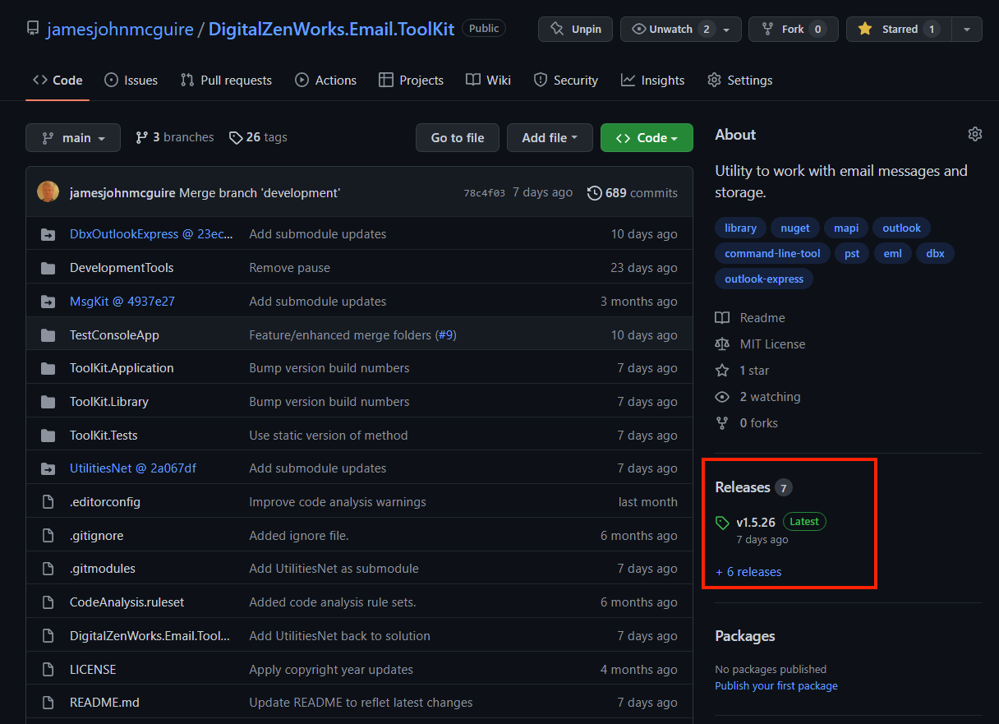
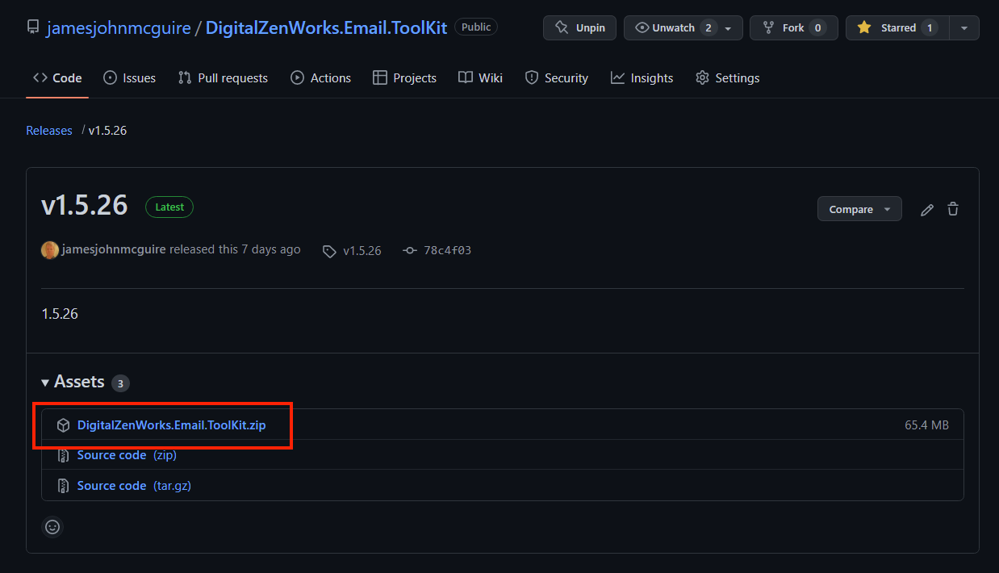

# Music Library Manager
A utility to help you manage your music library, including files and tags.

Our music libraries often get messy.  This is an utility to help get them clean up.

This, currently, primarily operates on a iTunes based library.  But a lot of the functionality is independent of iTunes and will continue to be expanded that way.

This has 3 main areas of functionality:
1. Cleaning up the tags (meta-data) inside the music files
2. Cleaning up the files, themselves, such as the filenames and paths
3. Cleaning up the iTunes connecting information about those files

## Getting Started

### Installation
#### Downloading the Program

If you are just interested in using the program, you can download the latest release by the following process:

1 Go to the releases tab   
2 Then choose the MusicManager.zip
 package   
3 Unzip the files somewhere accessible on your PATH  

Refer to 'Usage' section below.  

### Usage:

All usual disclaimers are applicable.  Not responsible for damage or loss.  Backup! Backup! Backup! before usage

Previously, iTunes was required to be installed before using.  This requirement now seems to be removed.  But it is still a bit fresh.  Obvisously, if iTunes is not installed, none of the iTunes functionality will be available.

Currently, the rules and options on how to process are a bit 'baked in'.  Next step is to extract those rules and options, so that people can customize to their own likings.

## Building

If you have iTunes installed, you should set the UseItunes environment variable to 'true', such as SET UseItunes=true and / or SETX UseItunes true.  Otherwise, it will build with a pre-generated Interop.iTunesLib.dll.  I

## Contributing

If you have a suggestion that would make this better, please fork the repo and create a pull request. You can also simply open an issue with the tag "enhancement".

### Process:

1. Fork the Project
2. Create your Feature Branch (`git checkout -b feature/AmazingFeature`)
3. Commit your Changes (`git commit -m 'Add some AmazingFeature'`)
4. Push to the Branch (`git push origin feature/AmazingFeature`)
5. Open a Pull Request

### Coding style
Please match the current coding style.  Most notably:  
1. One operation per line
2. Use complete English words in variable and method names
3. Attempt to declare variable and method names in a self-documenting manner

## License

Distributed under the MIT License. See `LICENSE` for more information.

## Contact

James John McGuire - [@jamesmc](https://twitter.com/jamesmc) - jamesjohnmcguire@gmail.com

Project Link: [https://github.com/jamesjohnmcguire/MusicLibraryManager](https://github.com/jamesjohnmcguire/MusicLibraryManager)
